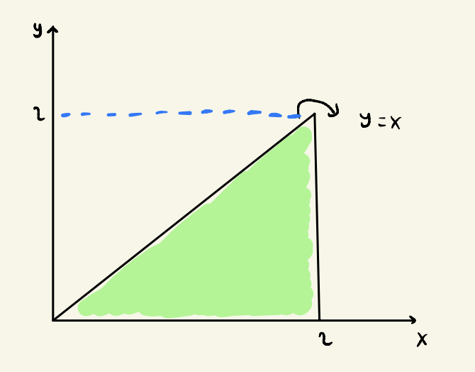
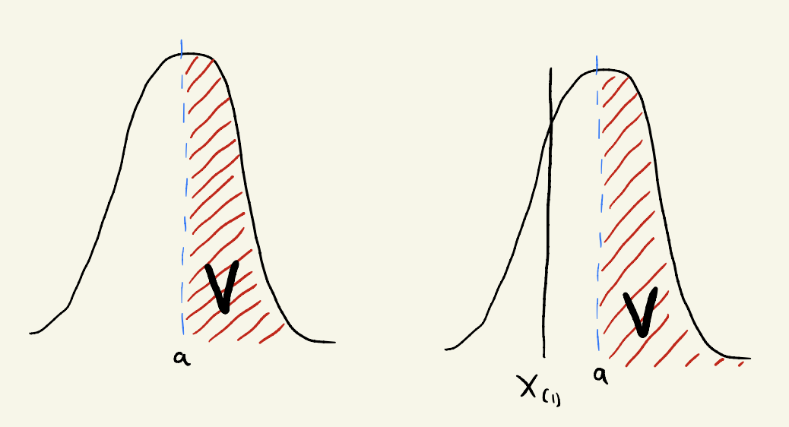

---
header-includes:
- \usepackage{fontspec}
output:
   pdf_document:
     latex_engine: xelatex
---

---
title: "qbs120_ps2_gibran"
author: "Gibran Erlangga"
date: "9/26/2021"
output: pdf_document
---

```{r setup, include=FALSE}
knitr::opts_chunk$set(echo = TRUE)
```

## Question 1
(Based on Rice 3.18) Let X and Y have the joint density function $f(x,y) = kxy$, $0 ≤ y ≤ x ≤ 2$ or $0$ elsewhere.  

a. Describe the region over which the density if positive and use it in determining limits of integration to answer the following questions.



b. Find k.  
Based on the region described above, we know that the boundaries of both X and Y axis to be 0 to 2 and 0 to X, respectively. We can present the formula as  

\begin{align*}
\int_{0}^{2}\int_{0}^{x}kxy\; dy\; dx &= 1 \\
k \int_{0}^{2} {xy^2 \over 2}\Biggr|_{1}^{9} dx &= 1 \\
k \int_{0}^{2} {x^3 \over 2} dx &= 1 \\
k {x^4 \over 8}\Biggr|_{0}^{2} &= 1 \\
k {16 \over 8} &= 1 \\
k &= {1 \over 2}
\end{align*}

c. Find the marginal densities of X and Y.

marginal density of X ($0 \le y \le x$):

\begin{align*}
f_{x}(x) &= \int_{0}^{x} {1 \over 2}xy dy \\
&= {1 \over 2}x {y^2 \over 2}\Biggr|_{0}^{x} \\
&= {1 \over 4}x^3
\end{align*}

marginal density of Y ($y \le x \le 2$):

\begin{align*}
f_{y}(y) &= \int_{0}^{x} {1 \over 2}xy dx \\
&= {1 \over 2}y {x^2 \over 2}\Biggr|_{y}^{2} \\
&= {1 \over 4}(4y - y^3) \\
&= y - {y^3 \over 4}
\end{align*}

d. Find the conditional densities of Y given X and X given Y.

\begin{align*}
f_{X|Y}(x|y) &= {f_{XY}(x, y) \over f_{y}(y)} \\
&= {{xy \over 2} \over y-{y^3 \over 3}} \\
&= {x \over 2-{y^3 \over 2}} \\
&= {2x \over 4-y^3}
\end{align*}

\begin{align*}
f_{Y|X}(y|x) &= {f_{XY}(x, y) \over f_{x}(x)} \\
&= {{xy \over 2} \over {x^3 \over 4}} \\
&= {2xy \over x^3} \\
&= {2y \over x^2}
\end{align*}

## Question 2
(Based on Rice 3.20) If X1 is uniform on [0,1], and, conditional on X1, X2 is uniform on [X1,2], find the joint and marginal distributions of X1 and X2.

Marginal distribution for $X_1$ ($0 \le x \le 1$):
\begin{align*}
f_{X}(x1) &= {1 \over b-a} \\
&= {1 \over 1-0} \\
f_{X}(x_{1}) &= 1 \\
\end{align*}

Joint distribution of X1 and X2:
\begin{align*}
f_{x1x2}(x_{1},x_{2}) &= f_{x1x2}(x_{2}|x_{1})~f_{x1}(x1) \\
&= {1 \over x_{1}}~1 \\
&= {1 \over x_{1}}
\end{align*}

with $0 < x_{2} < x_{1} < 1$.

Marginal distribution for $X_2$ ($X_{1} \le x \le 2$):
\begin{align*}
f_{x2}(x2) &= \int_{x2}^{2} f(x_{1}, x_{2})~dx_{1} \\
&= \int_{x2}^{2} f(x_{1}, x_{2})~dx1 \\
&= {x_{1}^2 \over 4}\Biggr|_{x2}^{2} \\ 
&= 1 - {x_{2}^2 \over 4}
\end{align*}

## Question 3
(Optional*) Rice 3.53: Consider forming a random rectangle in two ways. Let U1, U2, U3 be independent standard normal variables. One rectangle has  sides U1 and U2 and the other is square with side U3. Find the probability that the area of the square is greater than the area of the other rectangle. Hint: to find the distribution of the rectangle’s area, adapt the approach on page 98 for the quotient Z=Y/X to the product Z=XY; in this case, the density of Z is given by:

$$f_{Z}(z) = \int_{-\infty}^{\infty}{1 \over |x|}f_{X, Y}(x,z/x)dx$$

To find the distribution of the square’s area, start with the CDF and differentiate to get the density. If you get stuck on the integration by parts details, feel free to wait for the official solutions.

I don't know.

## Question 4
(Based on Rice 3.71) Let X1, ..., Xn be independent RVs all with the same density f. Find an expression for the probability that the interval [X(1),∞) encompasses at least 100v% of the probability mass of density f. Note: remember that the notation X(1) refers to the first order statistic.



From the left-hand side of above picture, we know that:

\begin{align*}
P(x>a) &= v \\
1-P(X \le a) &= v \\
P(X \le a) &= 1-v \\
F(a) &= 1-v \\
F^-1 F(a) &= F^-1(1-v) \\
a &= 1-v
\end{align*}

From the right-hand side of above picture, we know that:

\begin{align*}
P(X_{(1)}<a) &= F(X_{(1)}) \\
\end{align*}

Put $a$ value into the equation, we get:

\begin{align*}
F_{x1}(a) &= 1-[1-F(a)]^n \\
&= 1-(1-F({1-v \over F})^n) \\
&= 1-(1-1+v)^n) \\
F_{x1}(a) &= 1 - v^n
\end{align*}

## Question 5
(Based on Rice 4.31) Let X be uniformly distributed on the interval [1,4]. Find E[1/X]. Is E[1/X] = 1/E[X]? Note: find E[X] using the definition of expectation, don’t just plug in the expectation of a U(a,b) RV.

\begin{align*}
E[1/X] &= \int {1 \over x}f_{X}(x)~dx \\
&= \int_{1}^{4} {1 \over x}~dx \\
&= log(4) - log(1) \\
&= log(4) - 0 \\
&= 0.602
\end{align*}

\begin{align*}
E[X] &= \int xf_{X}(x)~dx \\
&= \int_{1}^{4} x~dx \\
&= {x^2 \over 2}\Biggr|_{1}^{4} \\
&= {15 \over 2}
\end{align*}

Thus,
\begin{align*}
1/E[X] = {15 \over 2} = {2 \over 15}
\end{align*}

So, $E[1/X] \neq 1/E[X]$


## Question 6
(Based on Rice 4.49) Two independent measurements, X and Y, are taken of a quantity μ. E[X] = E[Y] = μ, but σx and σy are unequal. The two measurements are combined by means of a weighted average to give:

$$Z = \alpha X + (1-\alpha)Y$$

where α is a scalar and 0 ≤ α ≤ 1.

a. Show that E[Z] = μ.
\begin{align*}
E(Z) &= μ \\
E[\alpha X + (1-\alpha) Y] &= \alpha E(X) + E(Y)(1 - \alpha) \\
&= \alphaμ + μ(1 - \alpha) \\
&= \alphaμ + μ - \alphaμ \\
&= μ
\end{align*}

b. If X and Y are not independent, what is E[Z]?

it would be same value as a), so it does not matter.

c. What is Var(Z)? Does this result hold if X and Y are not independent?

We know that variance sum is the sum of variance. Thus, 

\begin{align*}
Var(Z) &= Var[\alpha X + (1-\alpha)Y] \\
&= Var[\alpha X + (1-\alpha)Y] \\
&= Var(\alpha X) + Var((1-\alpha)Y) \\
&= \alpha^2Var(X) + (1-\alpha)^2Var(Y) \\
\end{align*}

d. Find $\alpha$ in terms of $\alpha~X$ and $\alpha~Y$ to minimize Var(Z).

We know that $Var(X) = \sigma^2X$ and $Var(Y) = \sigma^2Y$:
\begin{align*}
f(\alpha) &= \alpha^2\sigma^2X + (1-\alpha)^2\sigma^2Y \\
f'(\alpha) &= 2\alpha\sigma^2X + 2(1-\alpha)\sigma^2Y \\
\alpha &= {\sigma^2Y \over (\sigma^2X + \sigma^2Y)}
\end{align*}

e. Under what circumstances is it better (i.e., minimizing variance) to use the average (X + Y )/2 than either X or Y alone?
\begin{align*}
Var(X+Y)/2 &= {1 \over 2}^2 [Var(X+Y)] \\
&= {1 \over 4} [Var(X)+Var(Y)] \\
&= {1 \over 4}(\sigma_{X}^{2} + \sigma_{Y}^{2})
\end{align*}

\begin{align*}
{1 \over 4}\sigma_{X}^{2} + {1 \over 4}\sigma_{Y}^{2} &< \sigma_{X}^{2} \\
{\sigma_{X}^{2} \over \sigma_{Y}^{2}} < 3
\end{align*}

The conclusion is that it is better to use average as opposed to using them individually.

## Question 7
(Based on Rice 4.57) If X and Y are independent random variables, find E[XY] and Var(XY) in terms of the means and variances of X and Y. Hints: 4.1.1 Corollary A, realize that E[X2] = Var(X) + E[X]2

Given that $E[X^2] = Var[X] + E[X]^2$:

\begin{align*}
E[XY^2] &= Var[X] + E[X]^2 \\
Var(XY) &= E[XY^2] - E[XY]^2 \\
E(X^2Y^2) &= E[X^2] - E[Y^2] \\
Var(XY) &= E(X^2)E(Y^2) - [E(X)E(Y)]^2 \\
&= Var(X) + [E(X)^2] + Var(Y) + [E(Y)]^2 - [E(X)E(Y)]^2 \\
&= Var(X)Var(Y) + Var(X)[E(Y)]^2 + Var(Y)[E(X)^2] \\
\end{align*}
